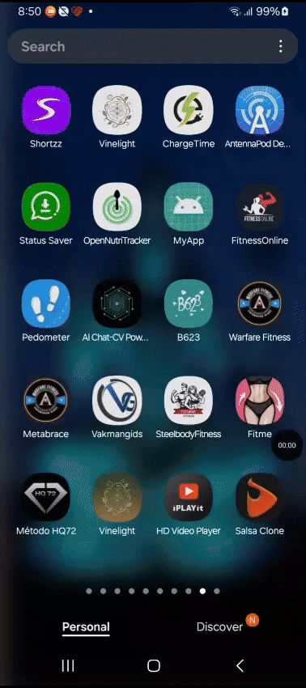
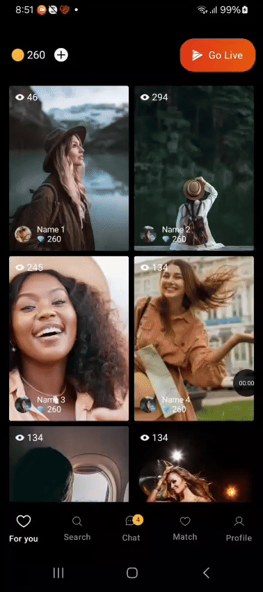

# Salsa Clone – Go Live. Get Gifts. Earn Money.

*Built with Android Jetpack Compose (MVI architecture)*

---

## About Salsa

**Go Live with Salsa – India’s Most Exciting Social Streaming App!**

Salsa is the ultimate live streaming platform for creators, entertainers, and fans. Go live instantly, show your skills, connect with new people, and earn rewards through virtual gifts that you can redeem as real cash.

Whether you want to broadcast, watch, chat, or gift your favorite creators, Salsa is your all-in-one social streaming destination.  
The full Salsa experience, recreated as an open-source Android app using the latest Compose UI, MVI architecture, and a modern tech stack!

---

## App Details

| App Name   | Description                                                                                                 | Tech Stack                                    | Play Store Link                                         |
|------------|------------------------------------------------------------------------------------------------------------|----------------------------------------------|---------------------------------------------------------|
| [Salsa Clone](https://drive.google.com/file/d/1PpQA5laEjt0_MkqTk6jXkWU7GVJe678m/view?usp=drive_link) | Social live streaming: Watch and host streams, gift users, earn diamonds, chat, video calls & more.         | Android, Kotlin, Jetpack Compose, MVI        | [Salsa Official](https://play.google.com/store/apps/details?id=com.angel.snapchat) |

---

## Features

### As a Viewer
- **Watch Live Streams Anytime:** Browse and discover streams from creators across India.
- **Chat, React & Join Live:** Join the conversation, send stickers, and join group video chats.
- **Send Gifts Using Coins:** Buy coins, send animated gifts, and support your favorite creators.
- **Try Online Video Chat:** Instantly join a video call with real people, nearby or nationwide.
- **Live Talk with Real People:** Enter live voice rooms to meet and chat with new friends.
- **Daily Rewards & Bonuses:** Check in daily for free coins, bonuses, and leaderboard climbs!

### As a Creator
- **Start a Live Stream Instantly:** Go live and showcase your talent in one tap.
- **Host Your Own Broadcast:** Reach and grow your fanbase with interactive streams.
- **Earn Diamonds & Redeem for Cash:** Receive gifts, collect diamonds, and cash out.
- **Build Your Fanbase:** Engage, chat, reply, and interact with your growing audience.
- **Private Online Chat & Video Chat:** Offer exclusive one-on-one moments for your fans.

---

## Getting Started

**Clone this repository:**
git clone https://github.com/yourusername/salsa-clone.git

- Open the project in Android Studio (`File > Open` or `File > New > Project from Version Control`)
- Sync Gradle and build the project.
- Run on your device (minimum SDK Android 6.0+, camera and microphone permissions required).

---

## Tech Stack

- Android, Kotlin, Jetpack Compose
- MVI architecture (Model-View-Intent pattern)
- Hilt for dependency injection
- Retrofit / OkHttp for networking
- Coil for image loading
- CameraX for streaming support
- Accompanist for Compose extensions (permissions, shimmer, navigation animations, system UI)
- ViewModel & LiveData for lifecycle-aware state management
- Razorpay integration for in-app payments and gifting

---

## Dependencies

Core dependencies used in app.

## 1. AndroidX Libraries
- androidx.core.ktx: Provides Kotlin extensions for AndroidX core library, offering convenience methods and enhancements.
- androidx.appcompat: Supports backward compatibility with older versions of Android (i.e., AppCompatActivity).
- androidx.material: Implements Google's Material Design components and widgets.
- androidx.activity: Provides activity-related functionality such as lifecycle and context support.
- androidx.constraintlayout: Enables complex layouts using constraint-based design (e.g., ConstraintLayout).
- androidx.navigation.fragment.ktx: Kotlin extensions for Navigation component, simplifying navigation-related tasks.
- androidx.navigation.ui.ktx: Kotlin extensions for integrating the Navigation component with UI elements like toolbar and bottom navigation.
- androidx.media3.exoplayer: Provides media playback capabilities with ExoPlayer, handling different media formats and streams.
- androidx.compose.bom: Bill of Materials (BOM) for Jetpack Compose to manage versions for Compose libraries.
- androidx.ui.graphics: Provides graphical utilities, such as color and drawing APIs, for Compose.
- androidx.ui.tooling.preview: Tools for UI design and live previews in Android Studio using Jetpack Compose.
- androidx.material3: Material Design 3 library with new design components.
- androidx.runtime.livedata: LiveData extensions for Android runtime, managing UI-related data in a lifecycle-conscious way.

## 2. Testing Libraries
- junit: Unit testing framework.
- androidx.junit: Android-specific extensions for JUnit, allowing tests to be run on Android.
- androidx.espresso.core: Provides UI testing tools to interact with the UI and validate its state.

## 3. Android Lifecycle Components
- lifecycle-livedata-ktx: LiveData extensions for Kotlin, useful for observing and managing lifecycle-bound data.
- lifecycle-viewmodel-ktx: ViewModel extensions for Kotlin, supporting lifecycle-aware components.

## 4. Retrofit (Networking)
- retrofit: Type-safe HTTP client for Android, used for making network requests and interacting with REST APIs.
- converter-gson: Converter for Retrofit to handle JSON to Java/Kotlin object conversion using Gson.

## 5. Jetpack Compose (UI Framework)
- activity-compose: Support for integrating Jetpack Compose with the Activity lifecycle.
- compose.ui: Core UI components for Jetpack Compose.
- compose.material: Material Design components for Compose UI.
- lifecycle-runtime-ktx: Lifecycle components, allowing the use of lifecycle-aware components like ViewModel, LiveData, etc.

## 6. Accompanist (Jetpack Compose Extensions)
- accompanist-permissions: Simplifies handling of permissions in Jetpack Compose.
- accompanist-swiperefresh: Swipe-to-refresh functionality for Compose-based UIs.
- accompanist-shimmer: Adds shimmer loading effect composable.
- accompanist.systemUI: Utilities for system UI controller integration.
- accompanist.navigation.animation: Enables animated transitions for navigation in Compose.

## 7. Dagger & Hilt (Dependency Injection)
- dagger: A dependency injection framework to manage dependencies in a type-safe and modular way.
- dagger-compiler: Compiler plugin for generating Dagger code.
- hilt-android: Simplifies dependency injection with Dagger for Android apps.
- hilt-compiler: Compiler plugin for generating Hilt code.
- hilt-navigation-compose: Enables seamless integration of Hilt with Jetpack Compose.

## 8. Camera (CameraX Android Jetpack)
- camera-camera2: Camera2 implementation for CameraX.
- camera-lifecycle: Lifecycle aware components for CameraX.
- camera-view: UI component for CameraX preview.

---

## Architecture: MVI Structure

- **Model-View-Intent (MVI)**:  
  Unidirectional data flow where:
  - **Model**: Data and business logic layer.
  - **View**: Jetpack Compose UI layers.
  - **Intent**: User actions or events triggering UI updates.
  
- Each feature has its own ViewModel, state, repository, and related API layers.

---

## Project Directory Structure

- **data/**
     - **api/**        # API related interfaces and retrofit service definitions
     - **model/**        # Data models and DTOs**
     - **repository/**   # Data repositories handling data operations and caching

- **di/**               # Dependency Injection modules (e.g., Hilt setup)

- **ui/**               # Jetpack Compose UI screens and components
     - **components/**  # Reusable shared UI composables
     - **home/**        # Home screen and related UI
     - **profile/**     # Profile screen and features
     - **search/**      # Search feature UI and logic
     - **streaming/**   # Live streaming UI components and screens
     - **theme/**       # App-wide theming, colors, shapes, typography etc.

 - **utils/**             # Utility classes and helper functions

 - **MainActivity.kt**    # Entry point Activity handling navigation etc.

*Each module/feature is separated for easier maintainability and testing.*

*(Include your project structure image here if you want)*

---

## Why Use Activity for Live Show?

- Better deep link handling support.
- Lifecycle control for streaming resources.
- Avoids back stack issues common with fragments from external entry points.
- Simplified isolation for resource-heavy streaming features.

---

## Demo Videos

Watch the demo videos showcasing key features of the Salsa Clone app like GIfs to watch full videos:

-   -   -   -   
  

---

## How to watch

Click on the thumbnails above to view the full demos on Vimeo.  
They demonstrate key user flows and UI interactions of our live streaming app.

---

## Contribution

Contributions, bug reports, and feature requests are welcome!  
Please open issues or submit pull requests on GitHub.

---

## License

This project is free to use and modify.  

---

## Contact

Have questions or suggestions? Feel free to file an issue on GitHub or contact.

---

**Ready to stream, gift, and earn? Download and start your Salsa Clone journey today!**

---

### Notes:
- Replace placeholder links like repository URLs, contact info with your actual details.
- Add screenshots and logo images for better readability.

---

If you want, I can also generate a minimal markdown template version or add badges (build status, license, etc.). Just ask!

